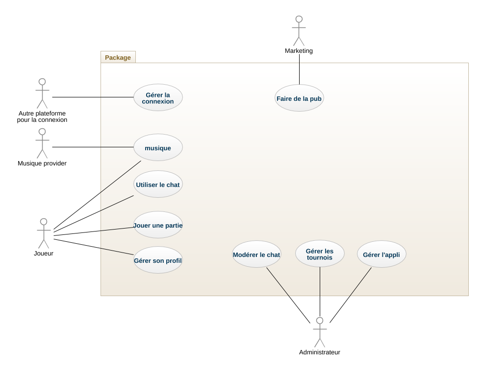

# I Fondements du projet

## 1. But du projet

### a. Problème de l’utilisateur ou contexte du projet

Il existe déjà des applications de jeu de tarot mais peu d'entre elles n'ont
pour objectif de promouvoir le tarot chez les jeunes avec les codes
d'aujourd'hui. Nous avons donc décidé de faire ce projet pour essayer de
ramener au goût du jour ce jeu qui peut plaire à énormément de jeunes de nos
jours. En effet les codes pour plaire aux communautés aujourd'hui ne sont pas
les mêmes qu'avant. Le but est de générer de l’engouement pour le tarot à
l'aide d'une application qui va permettre simplement de découvrir ce jeu, mais
aussi à l'aide de modes compétitifs en ligne pour entretenir le divertissement
chez les joueurs avec l'esprit de compétition. A l'ère des jeux vidéos
compétitifs tels League of Legends, Counter Strike ou encore Hearstone, il est
important d'aller chercher là où sont les joueurs, dans le milieu compétitif
en ligne.

### b. Objectifs du projet

L'objectif du projet est de créer le milieu de jeu parfait pour jouer au tarot
en ligne comme en local sur des écrans. Toutes les fonctionnalités devront
prendre en compte un usage facile pour l'utilisateur pour pouvoir attirer
mêmes les personnes les moins à l'aise avec la technologie. Grâce à cette
application, sera aussi rendu plus simple la participation à des tournois et
des compétitions de tarot, alors qu'aujourd'hui certaines personnes jouant au
jeu ne savent simplement pas où aller pour jouer de manière compétitive.

## 2. Personnes et organismes impliqués dans les enjeux du projet

### a. Maître d’ouvrage

Les financeurs de l’application sont les concepteurs de celle-ci.

### b. Acheteur

L'application sera gratuite, cependant les acheteurs de la version payante
seront les joueurs qui voudront une expérience de jeu plus propre et sans
dérangements comme les pubs. Il y aura aussi les joueurs qui voudront
participer aux tournois réservés aux membres premium pour pouvoir jouer entre
personnes sérieuses.

### c. Autre parties prenantes

Les hébergeurs de serveurs.

## 3. Utilisateurs du produit

### a. Utilisateurs directs du produit

Les utilisateurs du produit seront les personnes jouant déjà au Tarot ainsi
que les personnes découvrant l'application pour essayer de se mettre au tarot.
Le nombre d'utilisateurs est estimé à 15000 personnes en France.

Le public visé est évidemment la population de personnes jouant déjà au tarot,
mais aussi les jeunes (18-30 ans) qui peuvent avoir envie de découvrir de
nouveaux jeux en ligne. La population attendue est donc hétéroclite, des plus
jeunes aux plus vieux avec ou sans beaucoup d'expérience avec les applications
et internet. Le point commun de toutes ces personnes est qu'elles aiment les
jeux de cartes et/ou la compétition en ligne.

### b. ~~Priorité assignée aux utilisateurs~~

### c. ~~Implication nécessaire de la part des utilisateurs dans le projet~~

### d. Utilisateurs concernés par les opérations de maintenance du produit

Les opérations de maintenance seront opérées par les développeurs de
l'application ainsi que par Google pour ce qui est de la partie serveurs.

# II Contraintes sur le projet

## 4. Contraintes non négociables

### a. Contraintes sur la conception de la solution

Tout d'abord, le jeu doit respecter les
[règles officiels](http://www.fftarot.fr/assets/documents/R-RO201206.pdf)
du tarot français.

La solution sera multisupports En effet, la cible étant le grand public,
le produit doit être utilisable sur un maximum d'appareils. Ainsi, on définit
les contraintes suivantes :

- La solution doit fonctionner sur plusieurs plateformes.
- La solution doit fonctionner de la même manière sur toute les plateformes.
- La solution doit fonctionner notamment sur:
  - Un téléphone mobile (Android et iOS), sous la forme d'une application ou
  dans le navigateur internet.
  - Un ordinateur via l'un navigateurs internets les plus communs
  (Google chrome, Mozilla Firefox, Microsoft edge, Opera, ...).
- L'utilisation d'une plateforme par rapport à une autre doit être parfaitement
transparent et interchangeable pour l'utilisateur. Le produit devra
notamment :
  - Utiliser un même compte entre les différentes plateformes, afin de
  conserver le profil de l'utilisateur.
- Le système de *matchmaking* et le système de classement doivent être
indépendant de la plateforme.
- Utiliser une plateforme plutôt qu'une autre ne doit pas avoir d'avantages
autres qu'ergonomiques sur les parties.

L'évaluation de la satisfaction de ces contraintes devra se faire par
comparaison entre les différents supports. On jugera ces contraintes satisfaites si l'utilisation d'un support plutôt qu'un autre n'affecte pas l'expérience de l'utilisateur.

### b. Environnement de fonctionnement du système actuel

Le tarot se joue de manière classique sur une table, avec des cartes et des
personnes physiques. Ainsi, la convivialité et l'ambiance agréable sont de
mises et participent fortement au plaisir du jeu.

C'est pourquoi le produit doit pouvoir recréer un tel environnement afin de
favoriser une bonne expérience utilisateur. Même si l'environnement physique
pourra être extrêmement différent d'un utilisateur à l'autre, ou d'un moment à
l'autre, le produit doit pouvoir insuffler à l'utilisateur cette ambiance
conviviale.

### c. ~~Applications « partenaires » (avec lesquelles le produit doit collaborer)~~

### d. ~~« COTS » : Progiciels ou composants commerciaux~~

### e. ~~Lieux de fonctionnement prévus~~

### f. ~~De combien de temps les développeurs disposent-ils pour le projet ?~~

### g. ~~Quel est le budget affecté au projet ?~~

## 5. Glossaire et conventions de dénomination

- **Tarot** : On entend pas Tarot, le jeu du tarot français dont on peut trouver les règles sur le site de la
[fédération française de tarot](http://www.fftarot.fr/assets/documents/R-RO201206.pdf).
- **Joueur** : Ou utilisateur. Personne utilisant l'application.
- **Administrateur** : Personne possédant des capacités d'organisations
d'évènement dans l'application
- **Matchmaking** : Algorithme permettant l'appariement des joueurs dans les
parties en lignes en fonction de leur classement.
- **Classement ELO** : Méthode de classement des joueurs à base d'un score.
- **Emoji** : Pictogramme visuel permettant de représenter une émotion.
- **Chat textuel** : Moyen de communication en temps réel entre les joueurs,
sous la forme de messages.
- **Jeu en local** : Jeu sans connexion internet.
- **Membre premium** : Utilisateur possédant à un abonnement payant.
- **Bot** : Ou intelligence artificielle. Algorithme simulant un joueur humain.
- **Haut-fait** : Challenge global. Le réussir montre d'un dénote d'un
investissement particulier dans le jeu.

## 6. Faits et hypothèses utiles

### a. Facteurs influençant le produit, mais qui ne sont pas des contraintes imposées sur les exigences

- Nombre important de joueur nécessaire afin de trouver rapidement une partie
en ligne.

### b. Hypothèses que l’équipe fait sur le projet

- L'application pourrait obtenir un statut officiel et être homologué pour des
compétitions de fédération de tarot en ligne.

# III	Exigences fonctionnelles
## 7. Portée du travail
### a. La situation actuelle
Le tarot est un jeu de convivialité, les joueurs se retrouvent autour d'une table pour jouer ensmeble au tarot. Cependant la situation sanitaire actuelle empêche le bon dérouellement des parties. Les joueurs passionnés frustrés de ne pas pouvoir jouer au tarot recherche des solutions pour combler leur manque. Notre projet cherche à répondre à ce besoin en proposant une application de tarot.
### b. Contexte du travail
### c. Division du travail en événements métier

## 8. Portée du produit (cas d’utilisations)

### a. Limites du produit : diagramme de cas d’utilisation

On montre les limites du produit avec le digramme aux limites.

### b. Description sommaire des cas d’utilisation

[Liste des exigences utilisateurs](120.cdc.exigences_utilisateurs.md)

## 9. Exigences fonctionnelles et exigences sur les données

### a. Exigences fonctionnelles

[Liste des exigences fonctionnelles](120.cdc.exigences_fonctionnelles.md)

# IV	Exigences non fonctionnelles
## 10. Ergonomie et convivialité du produit
### a. L’interface
### b. Le style du produit (packaging inclus)
## 11. Facilité d’utilisation et facteurs humains
### a. Facilité d’utilisation
### b. Personnalisation et internationalisation
### c. Facilité d’apprentissage
### d. Facilité de compréhension et politesse
### e. Exigences d’accessibilité
## 12. Fonctionnement du produit
### a. Rapidité d’exécution et temps de latence
### b. Exigences critiques de sûreté
### c. Précision et exactitude
### d. Fiabilité et disponibilité
### e. Robustesse ou tolérance à un emploi erroné
### f. Capacité de stockage et montée en charge
### g. Adaptation du produit à une augmentation de volume à traiter
### h. Longévité
## 13. Adéquation du produit avec son environnement
### a. Environnement physique prévu
### b. Environnement technologique prévu
### c. Applications « partenaires » (avec lesquelles le produit doit collaborer) 
### d. Approche « produit » prêt à être commercialisé
## 14. Maintenance, support, portabilité, installation du produit
### a. Maintenance du produit
### b. Conditions spéciales concernant la maintenance du produit
### c. Exigences en matière de support
### d. Exigences de portabilité
### e. Installation du système
## 15. Sécurité
### a. Accès au système
### b. Intégrité
### c. Protection des données à caractère personnel
### d. Audit et traçabilité
### e. Protection contre les infections
## 16. Exigences culturelles et politiques
### a. Exigences culturelles
### b Exigence politiques
## 17. Lois et standards influençant le produit
### a. Conformité avec la loi
### b. Conformité avec des standards
